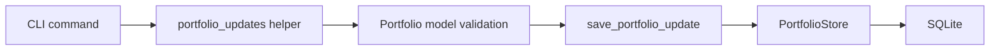
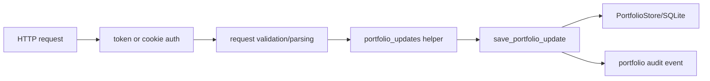
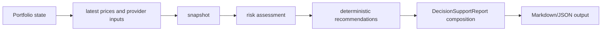
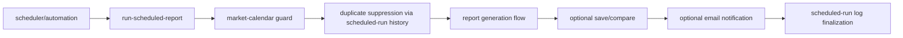
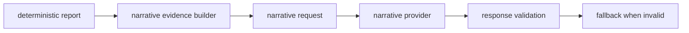

# Finwall architecture overview

This document describes the **current** Finwall architecture boundaries and request/data flows so contributors can add changes without moving decision logic into the wrong layer.

Finwall is a **decision-support tool**, not a broker integration and not an execution engine.

## Layered architecture

### 1) Domain model layer

Primary module: `src/finwall/models.py`

Owns validated domain state and entities, including portfolio and related records (cash balances, holdings, transactions/trades, active orders, watchlist items, goals, timeline, and risk profile).

This layer should model data and invariants. It should not make network calls or own transport concerns.

### 2) Persistence layer

Primary modules:

- `src/finwall/storage.py`
- `src/finwall/storage_interface.py`
- `src/finwall/storage_factory.py`

Owns state persistence and history storage using the store abstraction, including:

- portfolio state
- report run history
- scheduled-run history
- portfolio audit history

This layer persists and retrieves state; it must not generate recommendation decisions.

### 3) Provider/input layer

Representative modules:

- `src/finwall/market_data.py`
- `src/finwall/fundamentals.py`
- `src/finwall/news.py`
- `src/finwall/narrative.py` provider builder (for optional narrative output)

Owns external input acquisition and provider abstraction patterns (including static/disabled/fallback styles used in the codebase). This layer feeds deterministic analysis with input data; it does not own business decisions.

### 4) Deterministic analysis layer

Representative modules:

- `src/finwall/snapshot.py`
- `src/finwall/risk.py`
- `src/finwall/order_evaluation.py`
- `src/finwall/technical_analysis.py`
- `src/finwall/market_condition.py`
- `src/finwall/fundamental_summary.py`
- `src/finwall/news_summary.py`
- `src/finwall/recommendations.py`

Owns deterministic portfolio math, thresholds, scoring, risk checks, and recommendation statuses.

This is the core decision-support engine and source of deterministic truth.

### 5) Structured report layer

Primary module: `src/finwall/reports.py`

Owns `DecisionSupportReport` composition and rendering (`to_markdown`, `to_json`) from deterministic outputs.

It structures output for downstream surfaces without changing deterministic decisions.

### 6) Optional narrative layer

Primary module: `src/finwall/narrative.py`

Owns constrained narrative rewriting/explanation based on structured evidence from deterministic outputs.

The narrative/provider layer is optional and downstream. It can explain deterministic results, but cannot override calculations, thresholds, warnings, or recommendation statuses.

### 7) Interface/surface layer

Primary modules/entry points:

- `src/finwall/cli.py`
- `src/finwall/api.py`
- scheduled execution path via CLI command `run-scheduled-report`
- email output via notification helpers used by scheduled reports

Owns user/system interaction surfaces (CLI args, HTTP/admin requests, scheduler integration, output transport such as terminal/JSON/email).

This layer should orchestrate and present data, not own finance decision rules.

## Main request/data flows

### Local CLI portfolio update flow

Notes:

- CLI routes commands and delegates mutations to `portfolio_updates` helpers used as shared mutation paths.
- Mutation helpers should avoid duplicating deeper deterministic decision logic unnecessarily.

### API/admin portfolio update flow

Notes:

- API/admin mode is an internal update surface, not a brokerage interface.
- It should validate/authenticate/transport updates and persist audit history, without becoming a finance-rule owner.

### Report generation flow

Notes:

- `report_pipeline.build_deterministic_report_artifacts(...)` now orchestrates deterministic composition.
- CLI orchestration (`build_report_payload(...)`) layers deterministic save/compare metadata on top of those artifacts and remains narrative-independent.

### Scheduled report flow

Notes:

- Non-trading-day checks can skip execution.
- Duplicate suppression relies on scheduled-run history semantics before full report generation.

### Narrative flow

Notes:

- Narrative is optional downstream presentation.
- Narrative output must never own or override deterministic calculations or recommendation statuses.

## Deterministic logic vs presentation logic

| Responsibility | Owner | Notes |
|---|---|---|
| Portfolio math and valuation | `snapshot.py` (+ inputs consumed by risk/order analysis) | deterministic only |
| Risk thresholds and warnings | `risk.py` | deterministic only |
| Recommendation status generation | `recommendations.py` | deterministic only |
| Report object composition and rendering | `reports.py` | structured output from deterministic results |
| CLI command routing and printing | `cli.py` | input/output orchestration only |
| API/admin HTML + HTTP handlers | `api.py` | internal input/presentation surface |
| Narrative rewrite/explanation | `narrative.py` | optional explanation only |
| Future LLM/Ollama provider usage | narrative provider boundary | cannot change deterministic outputs |

## Current module ownership boundaries

| Module | Owns | Must not own |
|---|---|---|
| `models.py` | validated portfolio/domain data shapes | transport I/O orchestration and provider calls |
| `storage.py` | SQLite persistence and history/audit/scheduled-run records | business recommendation decisions |
| `snapshot.py` | deterministic valuation snapshot math | recommendation policy/status assignment |
| `risk.py` | deterministic risk warnings and checks | narrative or LLM output handling |
| `recommendations.py` | deterministic recommendation statuses and recommendation reasoning metadata | prose generation/provider integrations |
| `reports.py` | deterministic report composition/rendering | new recommendation/risk rules |
| `narrative.py` | constrained optional narrative rewrite + validation/fallback | overriding calculations/statuses |
| `cli.py` | command surface orchestration and output transport | owning deep finance decision policies |
| `api.py` | HTTP/admin input surface, auth checks, persistence/audit routing | owning finance calculations or recommendation policy |

## Maintainer cleanup guidance

- Keep deterministic finance logic in deterministic modules (`snapshot.py`, `risk.py`, `recommendations.py`, `reports.py`) and out of narrative/presentation code.
- Keep CLI/API modules as thin orchestration surfaces over shared deterministic and mutation helpers.
- Treat storage/provider protocols and interfaces as intentional seams; do not remove them casually during cleanup.
- Keep report and narrative output layers downstream from recommendation logic; they must not become a second recommendation engine.

## Future LLM/Ollama boundary

Any future LLM/Ollama integration should remain downstream of deterministic report generation.

Required constraints:

- LLM/Ollama providers may only consume structured deterministic evidence.
- They may rewrite, summarize, or explain deterministic outputs.
- They must not calculate prices, allocations, risk thresholds, indicators, or recommendation statuses.
- They must not execute trades or suggest broker-execution actions.
- Future Ollama support should plug into the narrative provider layer (or an equivalently constrained downstream interface).
- The deterministic `DecisionSupportReport` and related deterministic analysis outputs remain the source of truth.
